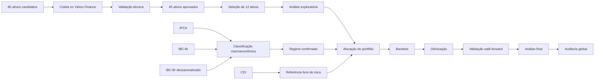
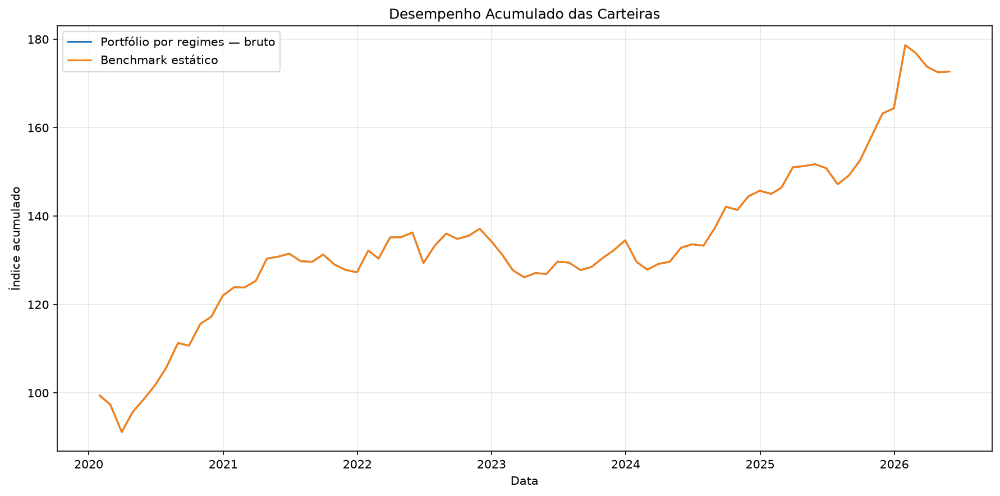
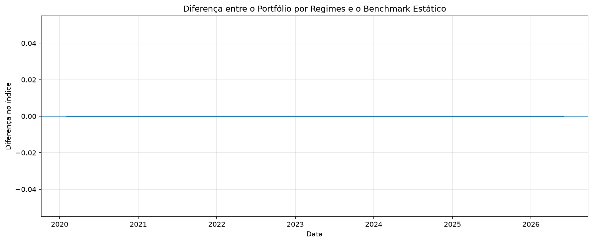

<div align="center">

[](https://github.com/ArthurEdersonSilva?tab=repositories&q=topic:analise-quantitativa)
[](https://github.com/ArthurEdersonSilva?tab=repositories&q=topic:mercado-financeiro)
[](https://github.com/ArthurEdersonSilva?tab=repositories&q=topic:engenharia-de-dados)
[](https://github.com/ArthurEdersonSilva?tab=repositories&q=topic:automacao)

# 📈 Janus Asset Bot

## Alocação Quantitativa por Regimes Macroeconômicos

Estratégia multimercado que identifica o regime econômico brasileiro e ajusta a alocação entre **renda variável, renda fixa, moedas, commodities e CDI**.

---

**Tecnologias Utilizadas:**


</div>

---

## Sobre o projeto

O **Janus Asset Bot** é uma estratégia quantitativa multimercado baseada na identificação de regimes macroeconômicos.

O modelo busca compreender o cenário econômico brasileiro por meio de duas dimensões principais:

- direção da inflação;
- direção da atividade econômica.

A combinação dessas duas variáveis permite classificar a economia em quatro regimes distintos. A partir dessa classificação, o sistema pode alterar os pesos do portfólio entre diferentes classes de ativos.

O pipeline realiza:

- coleta de dados financeiros;
- validação técnica dos ativos;
- seleção do universo de investimento;
- coleta de indicadores macroeconômicos;
- análise exploratória;
- identificação dos regimes econômicos;
- alocação do portfólio;
- backtest;
- aplicação de custos;
- otimização;
- validação walk-forward;
- análise final;
- auditoria global.

---

## Hipótese central

> Diferentes classes de ativos apresentam comportamentos distintos em cada regime econômico. Portanto, um modelo capaz de identificar mudanças na inflação e na atividade econômica pode realizar uma alocação mais eficiente do que uma carteira estática.

---

## Visão geral do pipeline



---

## Resultado atual da preparação dos dados

<div align="center">

| Indicador | Resultado |
|:---|---:|
| Ativos candidatos analisados | **80** |
| Ativos aprovados tecnicamente | **45** |
| Ativos selecionados para o modelo | **12** |
| Segmentos representados | **4** |
| Séries macroeconômicas utilizadas | **4** |
| Meses com regime classificado | **255** |
| Meses processados na alocação | **77** |
| Período atual da carteira | **jan/2020 a mai/2026** |

</div>

---

## Universo de investimento

O modelo utiliza 12 ativos, divididos em quatro segmentos.

### Commodities

| Ativo | Representação |
|:---|:---|
| `GC=F` | Ouro |
| `NG=F` | Gás natural |
| `ZC=F` | Milho |

### Renda variável

| Ativo | Representação |
|:---|:---|
| `BOVV11.SA` | Mercado acionário brasileiro |
| `FIND11.SA` | Setor financeiro |
| `MATB11.SA` | Setor de materiais básicos |

### Moedas

| Ativo | Representação |
|:---|:---|
| `USDBRL=X` | Dólar em relação ao real |
| `EURBRL=X` | Euro em relação ao real |
| `JPYBRL=X` | Iene em relação ao real |

### Renda fixa

| Ativo | Representação |
|:---|:---|
| `IMAB11.SA` | Títulos públicos indexados à inflação |
| `B5MB11.SA` | IMA-B 5 |
| `IB5M11.SA` | IMA-B 5+ |

O CDI é tratado separadamente como:

- referência de taxa livre de risco;
- benchmark financeiro;
- possível ativo defensivo;
- componente auxiliar da otimização.

---

## Dados macroeconômicos

O projeto utiliza quatro séries oficiais do Banco Central do Brasil.

| Indicador | Código SGS | Frequência | Uso no modelo |
|:---|---:|:---|:---|
| IPCA | `433` | Mensal | Identificar a direção da inflação |
| IBC-Br | `24363` | Mensal | Acompanhar a atividade econômica |
| IBC-Br dessazonalizado | `24364` | Mensal | Identificar a tendência da atividade |
| CDI | `12` | Diária | Referência livre de risco e ativo auxiliar |

---

## IPCA

O IPCA mede a variação dos preços de produtos e serviços consumidos pelas famílias.

O índice considera grupos como:

- alimentação;
- transporte;
- habitação;
- saúde;
- educação;
- vestuário;
- comunicação;
- despesas pessoais.

No modelo, o IPCA é utilizado para identificar se a inflação está acelerando ou desacelerando.

```text
IPCA mensal
→ IPCA acumulado em 12 meses
→ comparação com o valor de três meses atrás
```

Regra utilizada:

```text
Variação maior que zero
→ inflação em alta

Variação menor ou igual a zero
→ inflação em queda
```

A variável construída pelo sistema é:

```text
IPCA_VARIACAO_3M_PP
```

---

## IBC-Br

O IBC-Br é o Índice de Atividade Econômica do Banco Central.

Ele funciona como um indicador mensal da atividade econômica brasileira e reúne informações relacionadas a setores como:

- indústria;
- comércio;
- serviços;
- agropecuária.

O IBC-Br não é o PIB oficial, mas funciona como um termômetro mensal da economia.

---

## IBC-Br dessazonalizado

A versão dessazonalizada procura remover efeitos que se repetem em determinados períodos do ano.

Exemplos:

- aumento das vendas no Natal;
- feriados;
- quantidade de dias úteis;
- períodos de safra;
- férias;
- movimentos típicos de determinados meses.

Isso permite comparar os meses de forma mais justa.

No modelo:

```text
IBC-Br dessazonalizado
→ média móvel de três meses
→ comparação com a média de três meses atrás
```

Regra utilizada:

```text
Variação maior que zero
→ crescimento em alta

Variação menor ou igual a zero
→ crescimento em queda
```

A variável construída pelo sistema é:

```text
IBC_BR_TENDENCIA_3M_PCT
```

---

## CDI

O CDI é utilizado como referência de rendimento de baixo risco.

A série possui frequência diária, o que significa que existe uma taxa registrada para cada dia útil.

O sistema acumula as taxas diárias de forma composta para calcular o retorno mensal.

```text
Taxas diárias do CDI
→ capitalização composta
→ retorno mensal do CDI
```

O CDI não é utilizado para definir o regime macroeconômico.

Ele serve como:

- referência de taxa livre de risco;
- comparação de desempenho;
- base para o cálculo de Sharpe;
- componente defensivo;
- alternativa de caixa.

Os 12 ativos do modelo não são todos baseados no CDI.

---

## Regimes macroeconômicos

O modelo cruza a direção da inflação com a direção da atividade econômica.

| Crescimento | Inflação | Regime |
|:---:|:---:|:---|
| Alta | Queda | Expansão desinflacionária |
| Alta | Alta | Expansão inflacionária |
| Queda | Alta | Estagflação |
| Queda | Queda | Recessão desinflacionária |

---

## Expansão desinflacionária

Características:

- atividade econômica em crescimento;
- inflação em desaceleração.

Tendência esperada:

- maior exposição à renda variável;
- ambiente favorável para ativos de risco;
- possibilidade de valorização de títulos de renda fixa.

---

## Expansão inflacionária

Características:

- atividade econômica em crescimento;
- inflação acelerando.

Tendência esperada:

- maior exposição a commodities;
- ativos ligados à inflação;
- proteção contra aumento de preços.

---

## Estagflação

Características:

- atividade econômica em queda;
- inflação em alta.

Tendência esperada:

- maior cautela;
- proteção cambial;
- commodities;
- ativos indexados à inflação;
- menor exposição à renda variável.

---

## Recessão desinflacionária

Características:

- atividade econômica em queda;
- inflação desacelerando.

Tendência esperada:

- maior exposição defensiva;
- renda fixa;
- CDI;
- redução de ativos de risco.

---

## Confirmação do regime

O modelo não altera o regime após apenas um mês diferente.

O novo regime precisa permanecer por três meses consecutivos para ser confirmado.

```text
Regime detectado
→ confirmação durante três meses
→ alteração do regime oficial
```

Essa regra reduz mudanças provocadas por oscilações pontuais.

A alocação utiliza também uma defasagem de um mês.

Isso evita utilizar no mesmo mês uma informação que ainda não estaria disponível no momento da decisão.

---

## Validação dos ativos

Cada ativo candidato passa por verificações como:

- período histórico disponível;
- quantidade de observações;
- cobertura dos dados;
- valores ausentes;
- datas duplicadas;
- preços não positivos;
- retornos extremos;
- preço congelado;
- lacunas temporais;
- consistência entre abertura, máxima, mínima e fechamento;
- atualização da série.

Os ativos podem receber os seguintes status:

```text
APROVADO
APROVADO_COM_RESSALVAS
REPROVADO
ERRO_COLETA
```

A validação completa é registrada em:

```text
data/processed/validacao_ativos_yfinance.csv
```

A seleção final utilizada pelo modelo fica em:

```text
data/processed/ativos_selecionados_modelo.csv
```

---

## Análise exploratória

A análise exploratória é realizada separadamente para:

- commodities;
- renda variável;
- moedas;
- renda fixa.

Para cada segmento, o sistema calcula:

- retorno diário;
- retorno acumulado;
- volatilidade;
- drawdown;
- correlação;
- estatísticas descritivas;
- cobertura histórica;
- qualidade dos dados.

Na execução atual foram gerados:

<div align="center">

| Resultado | Quantidade |
|:---|---:|
| Ativos analisados | **12** |
| Tabelas segmentadas | **32** |
| Gráficos | **24** |
| Retornos calculados | **1.597 observações** |

</div>

---

## Alocação inicial

Antes da otimização, o modelo utiliza pesos iguais entre os 12 ativos.

```text
100% ÷ 12 ativos = aproximadamente 8,33% por ativo
```

Essa alocação serve como ponto de partida técnico.

Na execução inicial:

<div align="center">

| Indicador | Resultado |
|:---|---:|
| Índice final do portfólio bruto | **172,69** |
| Índice final do benchmark estático | **172,69** |
| Diferença inicial | **0,00 ponto** |

</div>

A igualdade ocorre porque a carteira inicial e o benchmark utilizam os mesmos ativos com pesos iguais.

A diferenciação deve ocorrer após a etapa de otimização dos pesos por regime.

---

## Gráficos da alocação inicial

<div align="center">

### Desempenho acumulado bruto



### Drawdown das carteiras


### Diferença entre as carteiras



</div>

---

## Backtest

O backtest avalia o comportamento histórico da estratégia.

Entre as métricas calculadas estão:

- retorno acumulado;
- retorno anualizado;
- volatilidade anualizada;
- Sharpe;
- Sortino;
- Calmar;
- drawdown máximo;
- VaR;
- CVaR;
- turnover;
- custos de transação;
- meses positivos;
- desempenho por regime;
- métricas móveis;
- sensibilidade aos custos.

---

## Custos de transação

Os custos são aplicados sobre o turnover da carteira.

```text
Mudança nos pesos
→ cálculo do turnover
→ aplicação do custo
→ retorno líquido da estratégia
```

O objetivo é evitar resultados excessivamente otimistas.

---

## Otimização

A etapa de otimização testa diferentes combinações de parâmetros.

Entre eles:

- pesos por regime;
- meses de confirmação;
- participação do CDI;
- parâmetros de encolhimento;
- custos;
- janelas de treinamento;
- frequência de recalibração.

O objetivo é encontrar uma configuração que apresente equilíbrio entre:

- retorno;
- risco;
- estabilidade;
- turnover;
- robustez.

---

## Validação walk-forward

A validação walk-forward simula uma execução mais próxima da realidade.

O processo utiliza:

```text
Dados anteriores
→ treinamento
→ escolha dos parâmetros
→ teste no período seguinte
→ avanço da janela
```

O modelo nunca deve utilizar dados futuros para definir uma decisão passada.

Essa estrutura reduz o risco de vazamento temporal e overfitting.

---

## Etapas do sistema

| Etapa | Arquivo | Responsabilidade |
|:---:|:---|:---|
| 1 | `coletar_ativo_yfinance.py` | Coleta e valida os ativos candidatos |
| 2 | `01_coleta_dados.py` | Organiza preços e coleta os dados macroeconômicos |
| 3 | `02_analise_exploratoria.py` | Analisa os 12 ativos selecionados |
| 4 | `03_regimes_macroeconomicos.py` | Classifica os regimes econômicos |
| 5 | `04_alocacao_portfolio.py` | Constrói a carteira mensal |
| 6 | `05_backtest.py` | Calcula retorno, risco, custos e turnover |
| 7 | `06_otimizacao_estrategia.py` | Otimiza os parâmetros e executa walk-forward |
| 8 | `07_analise_resultados_finais.py` | Consolida resultados e métricas |
| 9 | `08_auditoria_global.py` | Verifica consistência, robustez e vazamento temporal |
| — | `main.py` | Executa e organiza todo o pipeline |

---

## Arquitetura do projeto

```text
alocacao_regime_macro/
│
├── main.py
├── requirements.txt
├── .gitignore
│
├── config/
│   └── config.yaml
│
├── src/
│   ├── coletar_ativo_yfinance.py
│   ├── 01_coleta_dados.py
│   ├── 02_analise_exploratoria.py
│   ├── 03_regimes_macroeconomicos.py
│   ├── 04_alocacao_portfolio.py
│   ├── 05_backtest.py
│   ├── 06_otimizacao_estrategia.py
│   ├── 07_analise_resultados_finais.py
│   └── 08_auditoria_global.py
│
├── data/
│   ├── raw/
│   │   ├── market/
│   │   ├── macro/
│   │   └── focus/
│   │
│   ├── processed/
│   ├── state/
│   └── cache/
│
└── outputs/
    ├── graficos/
    ├── tabelas/
    ├── modelo_final/
    ├── auditoria/
    ├── relatorios/
    ├── alertas/
    └── logs/
```

---

## Como executar

Clone o repositório:

```bash
git clone <URL_DO_REPOSITORIO>
cd alocacao_regime_macro
```

Crie o ambiente virtual:

```powershell
python -m venv .venv
```

Ative o ambiente virtual:

```powershell
.venv\Scripts\Activate.ps1
```

Instale as dependências:

```powershell
pip install -r requirements.txt
```

Defina a raiz do projeto:

```powershell
$env:PROJECT_ROOT = (Get-Location).Path
$env:PROJECT_CONFIG = (Resolve-Path .\config\config.yaml).Path
```

Execute o pipeline completo:

```powershell
python main.py
```

Liste as etapas disponíveis:

```powershell
python main.py --listar
```

---

## Execução manual

### Coleta dos dados

```powershell
python .\src\01_coleta_dados.py
```

### Análise exploratória

```powershell
python .\src\02_analise_exploratoria.py
```

### Classificação dos regimes

```powershell
python .\src\03_regimes_macroeconomicos.py
```

### Alocação do portfólio

```powershell
python .\src\04_alocacao_portfolio.py
```

### Backtest

```powershell
python .\src\05_backtest.py
```

### Otimização

```powershell
python .\src\06_otimizacao_estrategia.py
```

### Análise final

```powershell
python .\src\07_analise_resultados_finais.py
```

### Auditoria global

```powershell
python .\src\08_auditoria_global.py
```

---

## Principais arquivos gerados

```text
data/processed/
├── validacao_ativos_yfinance.csv
├── precos_ativos_utilizaveis.csv
├── ativos_selecionados_modelo.csv
├── precos_ativos_tratados.csv
├── retornos_ativos.csv
├── dados_macro_mensais.csv
├── regimes_macroeconomicos.csv
├── alocacao_portfolio_mensal.csv
└── backtest_portfolio_mensal.csv
```

```text
outputs/
├── graficos/
├── tabelas/
├── modelo_final/
├── auditoria/
├── relatorios/
├── alertas/
└── logs/
```

---

## Configuração

As regras do sistema ficam centralizadas no arquivo:

```text
config/config.yaml
```

O arquivo permite configurar:

- universo de ativos;
- período de coleta;
- critérios de qualidade;
- indicadores macroeconômicos;
- regras dos regimes;
- confirmação do regime;
- defasagem do sinal;
- custos;
- benchmark;
- limites de risco;
- parâmetros de otimização;
- janelas de walk-forward;
- diretórios de saída;
- gráficos;
- logs;
- auditoria.

---

## Status atual

As seguintes etapas já estão implementadas e executadas com o universo final de 12 ativos:

- coleta e organização dos dados;
- seleção dos ativos;
- análise exploratória;
- classificação dos regimes;
- alocação inicial do portfólio.

As etapas seguintes devem ser executadas novamente com o universo final:

- backtest;
- otimização;
- validação walk-forward;
- análise final;
- auditoria global.

---

## Limitações

- Resultados históricos não garantem desempenho futuro.
- A disponibilidade dos dados depende de fontes externas.
- Alguns ativos podem apresentar ressalvas de qualidade.
- A classificação depende dos indicadores e regras definidos.
- Mudanças estruturais na economia podem reduzir a eficiência do modelo.
- Otimização excessiva pode gerar overfitting.
- O modelo possui finalidade acadêmica e experimental.
- O projeto não constitui recomendação de investimento.

---

<div align="center">

## 👥 Desenvolvedor

👨‍💻 **Arthur Ederson — Engenharia de Computação (FIAP)**

[](https://www.linkedin.com/in/arthur-ederson-3a817285)

</div>
