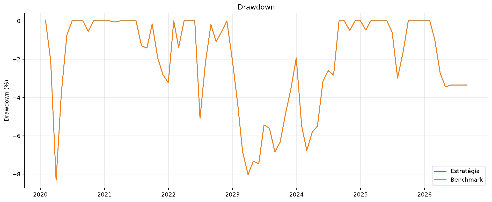
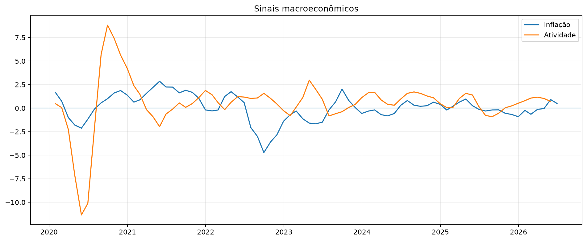
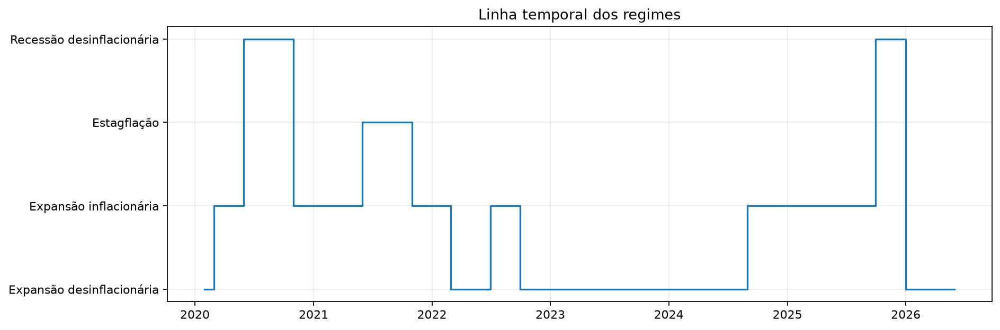
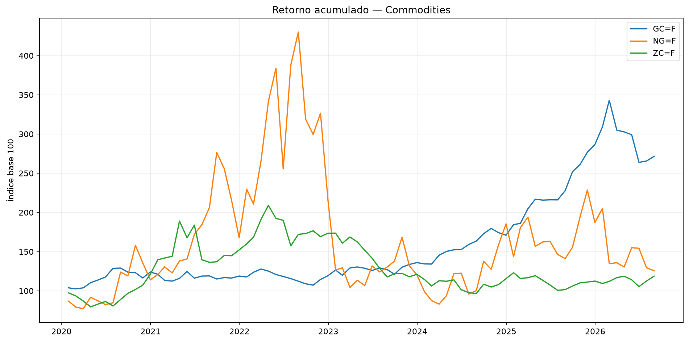
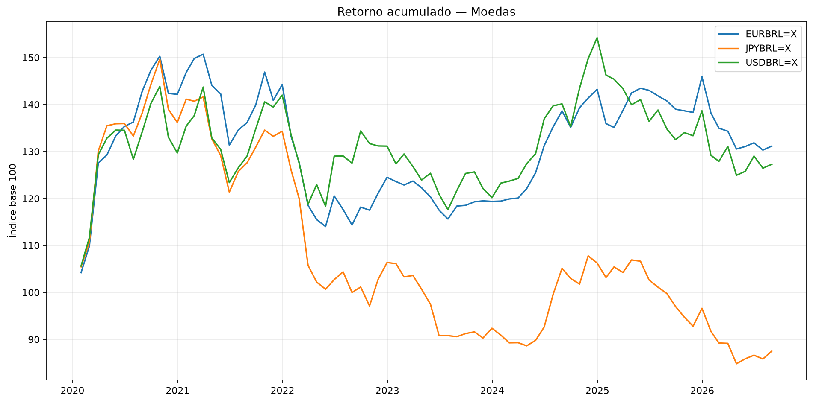
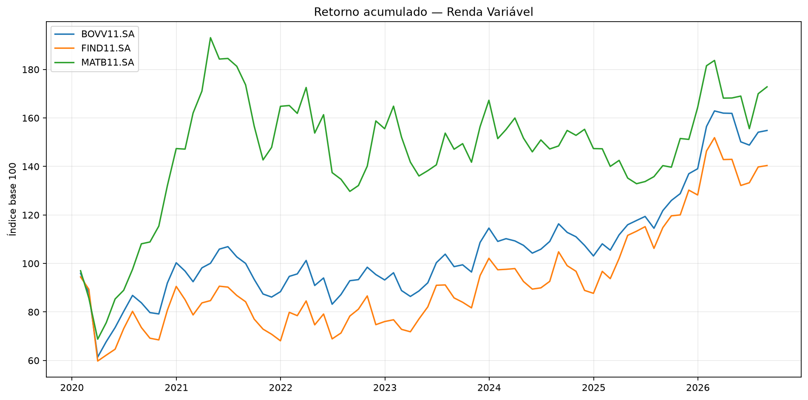

# Relatório Analítico Detalhado

## Alocação Quantitativa por Regimes Macroeconômicos

**Versão do gerador:** 1.0.0  
**Gerado em:** 05/08/2026 05:34:48 Hora oficial do Brasil  
**Período:** 31/01/2020 a 31/08/2026  
**Ativos selecionados:** 12  

> As análises e conclusões deste documento são construídas diretamente a partir dos dados calculados.

---

## 1. Como o relatório está organizado

1. qualidade e atualização das bases;
2. universo de investimento;
3. leitura macroeconômica;
4. episódios consecutivos dos regimes;
5. ativos individualmente e por segmento;
6. análise por ano e semestre;
7. carteira, benchmark e CDI;
8. melhores e piores momentos;
9. transições de regime;
10. consistência em janelas móveis;
11. contribuições dos ativos;
12. síntese técnica.

---

## 2. Qualidade e atualização das bases

| arquivo | caminho | existe | modificacao_utc | tamanho_bytes | possivelmente_desatualizado |
| --- | --- | --- | --- | --- | --- |
| selecao | data/processed/ativos_selecionados_modelo.csv | Sim | 04/08/2026 23:53 | 1951 | Sim |
| retornos | data/processed/retornos_ativos.csv | Sim | 04/08/2026 23:57 | 394387 | Sim |
| macro | data/processed/dados_macro_mensais.csv | Sim | 04/08/2026 23:57 | 49127 | Sim |
| regimes | data/processed/regimes_macroeconomicos.csv | Sim | 04/08/2026 23:58 | 71965 | Não |
| alocacao | data/processed/alocacao_portfolio_mensal.csv | Sim | 05/08/2026 00:06 | 81281 | Não |
| backtest | data/processed/backtest_portfolio_mensal.csv | Sim | 05/08/2026 00:06 | 124847 | Não |
| series_finais | outputs/tabelas/06_12_series_modelos_finais.csv | Sim | 05/08/2026 00:09 | 34101 | Não |
| metricas_finais | outputs/tabelas/06_12_metricas_finais_modelos.csv | Sim | 05/08/2026 00:09 | 2705 | Não |
| pesos_oficiais | outputs/tabelas/06_12_pesos_oficiais_atuais.csv | Sim | 05/08/2026 00:09 | 1316 | Não |
| scorecard | outputs/tabelas/07_05_scorecard_executivo.csv | Não | — | 0 | Não |
| auditoria | outputs/auditoria/08_06_diagnostico_final_corrigido.csv | Não | — | 0 | Não |

### Cobertura

| base | registros | inicio | fim | colunas | ausentes |
| --- | --- | --- | --- | --- | --- |
| retornos_diarios | 1597 | 03/01/2020 | 04/08/2026 | 13 | 0 |
| retornos_mensais | 80 | 31/01/2020 | 31/08/2026 | 13 | 0 |
| macro | 272 | 31/01/2004 | 31/08/2026 | 12 | 84 |
| regimes | 255 | 31/03/2005 | 31/05/2026 | 25 | 172 |
| alocacao | 77 | 31/01/2020 | 31/05/2026 | 57 | 0 |
| backtest | 77 | 31/01/2020 | 31/05/2026 | 90 | 0 |
| series_finais | 29 | 31/01/2024 | 31/05/2026 | 73 | 0 |

---

## 3. Universo de investimento

| ticker | segmento | classe | status |
| --- | --- | --- | --- |
| GC=F | Commodities | COMMODITY_OURO | APROVADO |
| NG=F | Commodities | COMMODITY_GAS_NATURAL | APROVADO |
| ZC=F | Commodities | COMMODITY_MILHO | APROVADO |
| EURBRL=X | Moedas | MOEDA_EURO | APROVADO_COM_RESSALVAS |
| JPYBRL=X | Moedas | MOEDA_IENE | APROVADO_COM_RESSALVAS |
| USDBRL=X | Moedas | MOEDA_DOLAR | APROVADO_COM_RESSALVAS |
| B5MB11.SA | Renda Fixa | RENDA_FIXA_INFLACAO_IMAB5 | APROVADO_COM_RESSALVAS |
| IB5M11.SA | Renda Fixa | RENDA_FIXA_INFLACAO_IMAB5_MAIS | APROVADO_COM_RESSALVAS |
| IMAB11.SA | Renda Fixa | RENDA_FIXA_INFLACAO_IMAB | APROVADO_COM_RESSALVAS |
| BOVV11.SA | Renda Variável | RENDA_VARIAVEL_BRASIL_IBOVESPA | APROVADO |
| FIND11.SA | Renda Variável | RENDA_VARIAVEL_FINANCEIRO | APROVADO |
| MATB11.SA | Renda Variável | RENDA_VARIAVEL_MATERIAIS | APROVADO |

### Distribuição por segmento

| segmento | quantidade |
| --- | --- |
| Commodities | 3 |
| Moedas | 3 |
| Renda Fixa | 3 |
| Renda Variável | 3 |

---

## 4. Leitura macroeconômica

| indicador | coluna | primeiro | ultimo | minimo | maximo |
| --- | --- | --- | --- | --- | --- |
| IPCA mensal | IPCA_MENSAL_PCT | 0,2100 | 0,1600 | -0,6800 | 1,6200 |
| IPCA em 12 meses | IPCA_12M_PCT | 4,1917 | 4,6413 | 1,8775 | 12,1315 |
| Tendência da inflação | IPCA_VARIACAO_3M_PP | 1,6566 | 0,4985 | -4,7181 | 2,8606 |
| IBC-Br | IBC_BR | 92,4520 | 109,5299 | 83,9582 | 117,8089 |
| IBC-Br dessazonalizado | IBC_BR_DESSAZONALIZADO | 97,6733 | 111,0359 | 83,0387 | 111,0359 |
| Tendência da atividade | IBC_BR_TENDENCIA_3M_PCT | 0,4709 | 0,7187 | -11,3480 | 8,8239 |
| CDI mensal | CDI_MENSAL_PCT | 0,3766 | 0,0525 | 0,0525 | 1,2757 |

O modelo interpreta a inflação pela direção do IPCA acumulado e a atividade pela tendência do IBC-Br dessazonalizado.

```text
Atividade alta + inflação em queda = Expansão desinflacionária
Atividade alta + inflação em alta = Expansão inflacionária
Atividade em queda + inflação em alta = Estagflação
Atividade em queda + inflação em queda = Recessão desinflacionária
```

---

## 5. Desempenho por regime

| regime | nome_regime | meses | frequencia | retorno_estrategia | volatilidade_estrategia | drawdown_estrategia | retorno_benchmark | volatilidade_benchmark | drawdown_benchmark | retorno_cdi | volatilidade_cdi | drawdown_cdi | excesso_vs_benchmark |
| --- | --- | --- | --- | --- | --- | --- | --- | --- | --- | --- | --- | --- | --- |
| EXPANSAO_DESINFLACIONARIA | Expansão desinflacionária | 34 | 0.44155844155844154 | 6,09% | 0.07470611342510826 | -0.0802650046127873 | 6,09% | 0.07470611342510826 | -0.0802650046127873 | 39,22% | 0.005743994351632513 | 0.0 | 0,00% |
| EXPANSAO_INFLACIONARIA | Expansão inflacionária | 30 | 0.38961038961038963 | 27,46% | 0.09335534222400874 | -0.0636215268498781 | 27,46% | 0.09335534222400874 | -0.0636215268498781 | 23,16% | 0.01348784236874729 | 0.0 | 0,00% |
| ESTAGFLACAO | Estagflação | 5 | 0.06493506493506493 | 0,69% | 0.03289961440619403 | -0.014180174645428867 | 0,69% | 0.03289961440619403 | -0.014180174645428867 | 1,82% | 0.002576414027101912 | 0.0 | 0,00% |
| RECESSAO_DESINFLACIONARIA | Recessão desinflacionária | 8 | 0.1038961038961039 | 26,49% | 0.05718704899862895 | -0.005470982310878947 | 26,49% | 0.05718704899862895 | -0.005470982310878947 | 4,59% | 0.017917136198143332 | 0.0 | 0,00% |

### Episódios consecutivos

| episodio | regime | nome_regime | inicio | fim | meses | retorno_estrategia | retorno_benchmark | retorno_cdi | excesso_vs_benchmark | melhor_ativo | retorno_melhor_ativo | pior_ativo | retorno_pior_ativo |
| --- | --- | --- | --- | --- | --- | --- | --- | --- | --- | --- | --- | --- | --- |
| 1 | EXPANSAO_DESINFLACIONARIA | Expansão desinflacionária | 31/01/2020 | 31/01/2020 | 1 | -0,67% | -0,67% | 0,38% | 0,00% | USDBRL=X | 5,62% | NG=F | -13,24% |
| 2 | EXPANSAO_INFLACIONARIA | Expansão inflacionária | 29/02/2020 | 30/04/2020 | 3 | -3,75% | -3,75% | 0,92% | 0,00% | JPYBRL=X | 28,47% | FIND11.SA | -34,15% |
| 3 | RECESSAO_DESINFLACIONARIA | Recessão desinflacionária | 31/05/2020 | 30/09/2020 | 5 | 15,64% | 15,64% | 0,96% | 0,00% | MATB11.SA | 44,01% | IB5M11.SA | 2,92% |
| 4 | EXPANSAO_INFLACIONARIA | Expansão inflacionária | 31/10/2020 | 30/04/2021 | 7 | 17,78% | 17,78% | 1,17% | 0,00% | ZC=F | 95,25% | JPYBRL=X | -8,02% |
| 5 | ESTAGFLACAO | Estagflação | 31/05/2021 | 30/09/2021 | 5 | 0,69% | 0,69% | 1,82% | 0,00% | NG=F | 100,17% | ZC=F | -27,47% |
| 6 | EXPANSAO_INFLACIONARIA | Expansão inflacionária | 31/10/2021 | 31/01/2022 | 4 | 0,68% | 0,68% | 2,60% | 0,00% | ZC=F | 16,63% | NG=F | -16,93% |
| 7 | EXPANSAO_DESINFLACIONARIA | Expansão desinflacionária | 28/02/2022 | 31/05/2022 | 4 | 3,08% | 3,08% | 3,60% | 0,00% | NG=F | 67,11% | JPYBRL=X | -20,12% |
| 8 | EXPANSAO_INFLACIONARIA | Expansão inflacionária | 30/06/2022 | 31/08/2022 | 3 | -0,19% | -0,19% | 3,25% | 0,00% | NG=F | 12,06% | MATB11.SA | -19,60% |
| 9 | EXPANSAO_DESINFLACIONARIA | Expansão desinflacionária | 30/09/2022 | 31/07/2024 | 23 | -2,06% | -2,06% | 25,18% | 0,00% | GC=F | 41,67% | NG=F | -77,69% |
| 10 | EXPANSAO_INFLACIONARIA | Expansão inflacionária | 31/08/2024 | 31/08/2025 | 13 | 11,90% | 11,90% | 13,86% | 0,00% | NG=F | 47,20% | MATB11.SA | -4,66% |
| 11 | RECESSAO_DESINFLACIONARIA | Recessão desinflacionária | 30/09/2025 | 30/11/2025 | 3 | 9,38% | 9,38% | 3,59% | 0,00% | NG=F | 61,83% | JPYBRL=X | -6,97% |
| 12 | EXPANSAO_DESINFLACIONARIA | Expansão desinflacionária | 31/12/2025 | 31/05/2026 | 6 | 5,79% | 5,79% | 6,95% | 0,00% | IMAB11.SA | 43,26% | NG=F | -32,16% |

### Episódio 1 — Expansão desinflacionária

- Período: **31/01/2020 a 31/01/2020**.
- Duração: **1 meses**.
- Estratégia: **-0,67%**.
- Benchmark: **-0,67%**.
- Excesso: **0,00%**.
- Melhor ativo: **USDBRL=X** (5,62%).
- Pior ativo: **NG=F** (-13,24%).

### Episódio 2 — Expansão inflacionária

- Período: **29/02/2020 a 30/04/2020**.
- Duração: **3 meses**.
- Estratégia: **-3,75%**.
- Benchmark: **-3,75%**.
- Excesso: **0,00%**.
- Melhor ativo: **JPYBRL=X** (28,47%).
- Pior ativo: **FIND11.SA** (-34,15%).

### Episódio 3 — Recessão desinflacionária

- Período: **31/05/2020 a 30/09/2020**.
- Duração: **5 meses**.
- Estratégia: **15,64%**.
- Benchmark: **15,64%**.
- Excesso: **0,00%**.
- Melhor ativo: **MATB11.SA** (44,01%).
- Pior ativo: **IB5M11.SA** (2,92%).

### Episódio 4 — Expansão inflacionária

- Período: **31/10/2020 a 30/04/2021**.
- Duração: **7 meses**.
- Estratégia: **17,78%**.
- Benchmark: **17,78%**.
- Excesso: **0,00%**.
- Melhor ativo: **ZC=F** (95,25%).
- Pior ativo: **JPYBRL=X** (-8,02%).

### Episódio 5 — Estagflação

- Período: **31/05/2021 a 30/09/2021**.
- Duração: **5 meses**.
- Estratégia: **0,69%**.
- Benchmark: **0,69%**.
- Excesso: **0,00%**.
- Melhor ativo: **NG=F** (100,17%).
- Pior ativo: **ZC=F** (-27,47%).

### Episódio 6 — Expansão inflacionária

- Período: **31/10/2021 a 31/01/2022**.
- Duração: **4 meses**.
- Estratégia: **0,68%**.
- Benchmark: **0,68%**.
- Excesso: **0,00%**.
- Melhor ativo: **ZC=F** (16,63%).
- Pior ativo: **NG=F** (-16,93%).

### Episódio 7 — Expansão desinflacionária

- Período: **28/02/2022 a 31/05/2022**.
- Duração: **4 meses**.
- Estratégia: **3,08%**.
- Benchmark: **3,08%**.
- Excesso: **0,00%**.
- Melhor ativo: **NG=F** (67,11%).
- Pior ativo: **JPYBRL=X** (-20,12%).

### Episódio 8 — Expansão inflacionária

- Período: **30/06/2022 a 31/08/2022**.
- Duração: **3 meses**.
- Estratégia: **-0,19%**.
- Benchmark: **-0,19%**.
- Excesso: **0,00%**.
- Melhor ativo: **NG=F** (12,06%).
- Pior ativo: **MATB11.SA** (-19,60%).

### Episódio 9 — Expansão desinflacionária

- Período: **30/09/2022 a 31/07/2024**.
- Duração: **23 meses**.
- Estratégia: **-2,06%**.
- Benchmark: **-2,06%**.
- Excesso: **0,00%**.
- Melhor ativo: **GC=F** (41,67%).
- Pior ativo: **NG=F** (-77,69%).

### Episódio 10 — Expansão inflacionária

- Período: **31/08/2024 a 31/08/2025**.
- Duração: **13 meses**.
- Estratégia: **11,90%**.
- Benchmark: **11,90%**.
- Excesso: **0,00%**.
- Melhor ativo: **NG=F** (47,20%).
- Pior ativo: **MATB11.SA** (-4,66%).

### Episódio 11 — Recessão desinflacionária

- Período: **30/09/2025 a 30/11/2025**.
- Duração: **3 meses**.
- Estratégia: **9,38%**.
- Benchmark: **9,38%**.
- Excesso: **0,00%**.
- Melhor ativo: **NG=F** (61,83%).
- Pior ativo: **JPYBRL=X** (-6,97%).

### Episódio 12 — Expansão desinflacionária

- Período: **31/12/2025 a 31/05/2026**.
- Duração: **6 meses**.
- Estratégia: **5,79%**.
- Benchmark: **5,79%**.
- Excesso: **0,00%**.
- Melhor ativo: **IMAB11.SA** (43,26%).
- Pior ativo: **NG=F** (-32,16%).

---

## 6. Análise dos ativos

| ticker | segmento | meses | retorno_total | retorno_anualizado | volatilidade_anualizada | sharpe | drawdown_maximo | meses_positivos | melhor_mes | pior_mes |
| --- | --- | --- | --- | --- | --- | --- | --- | --- | --- | --- |
| GC=F | Commodities | 80 | 171,53% | 16,16% | 16,04% | 0,43 | -23,09% | 58,75% | 10,96% | -11,79% |
| MATB11.SA | Renda Variável | 80 | 72,84% | 8,55% | 24,23% | 0,07 | -32,82% | 57,50% | 14,45% | -19,77% |
| BOVV11.SA | Renda Variável | 80 | 54,84% | 6,78% | 22,43% | -0,01 | -35,99% | 56,25% | 16,11% | -30,11% |
| IMAB11.SA | Renda Fixa | 80 | 48,57% | 6,12% | 15,53% | -0,16 | -8,24% | 27,50% | 37,96% | -7,51% |
| FIND11.SA | Renda Variável | 80 | 40,38% | 5,22% | 28,01% | -0,01 | -36,72% | 55,00% | 17,93% | -33,12% |
| EURBRL=X | Moedas | 80 | 31,15% | 4,15% | 11,99% | -0,38 | -24,33% | 56,25% | 16,11% | -7,67% |
| B5MB11.SA | Renda Fixa | 80 | 28,54% | 3,84% | 14,70% | -0,32 | -17,04% | 21,25% | 30,73% | -14,52% |
| IB5M11.SA | Renda Fixa | 80 | 27,53% | 3,71% | 9,80% | -0,54 | -12,30% | 56,25% | 8,08% | -12,30% |
| USDBRL=X | Moedas | 80 | 27,27% | 3,68% | 13,72% | -0,35 | -18,99% | 55,00% | 15,78% | -7,54% |
| NG=F | Commodities | 80 | 25,68% | 3,49% | 66,49% | 0,24 | -80,68% | 52,50% | 51,71% | -41,13% |
| ZC=F | Commodities | 80 | 18,77% | 2,61% | 26,80% | -0,12 | -53,80% | 57,50% | 31,15% | -24,03% |
| JPYBRL=X | Moedas | 80 | -12,50% | -1,98% | 13,94% | -0,73 | -43,32% | 47,50% | 17,51% | -11,87% |

### Ativos por regime

| regime | nome_regime | ticker | segmento | meses | retorno_total | retorno_anualizado | volatilidade_anualizada | sharpe | drawdown_maximo | meses_positivos | melhor_mes | pior_mes |
| --- | --- | --- | --- | --- | --- | --- | --- | --- | --- | --- | --- | --- |
| EXPANSAO_DESINFLACIONARIA | Expansão desinflacionária | GC=F | Commodities | 34 | 63,25% | 18,89% | 16,07% | 0,43 | -12,81% | 58,82% | 10,96% | -11,14% |
| EXPANSAO_DESINFLACIONARIA | Expansão desinflacionária | NG=F | Commodities | 34 | -78,06% | -41,46% | 64,60% | -0,65 | -87,27% | 47,06% | 29,93% | -41,13% |
| EXPANSAO_DESINFLACIONARIA | Expansão desinflacionária | ZC=F | Commodities | 34 | -31,69% | -12,59% | 19,48% | -1,19 | -48,56% | 50,00% | 13,53% | -10,98% |
| EXPANSAO_DESINFLACIONARIA | Expansão desinflacionária | EURBRL=X | Moedas | 34 | -0,02% | -0,01% | 9,64% | -1,16 | -14,40% | 52,94% | 5,50% | -7,16% |
| EXPANSAO_DESINFLACIONARIA | Expansão desinflacionária | JPYBRL=X | Moedas | 34 | -22,36% | -8,54% | 13,28% | -1,48 | -29,18% | 44,12% | 7,49% | -11,87% |
| EXPANSAO_DESINFLACIONARIA | Expansão desinflacionária | USDBRL=X | Moedas | 34 | -3,27% | -1,17% | 11,71% | -1,03 | -18,28% | 52,94% | 5,74% | -6,88% |
| EXPANSAO_DESINFLACIONARIA | Expansão desinflacionária | B5MB11.SA | Renda Fixa | 34 | 38,62% | 12,22% | 18,32% | 0,07 | -1,17% | 14,71% | 30,73% | -1,17% |
| EXPANSAO_DESINFLACIONARIA | Expansão desinflacionária | IB5M11.SA | Renda Fixa | 34 | 26,02% | 8,51% | 7,96% | -0,41 | -4,83% | 58,82% | 7,24% | -3,41% |
| EXPANSAO_DESINFLACIONARIA | Expansão desinflacionária | IMAB11.SA | Renda Fixa | 34 | 43,45% | 13,58% | 22,54% | 0,14 | -0,36% | 17,65% | 37,96% | -0,36% |
| EXPANSAO_DESINFLACIONARIA | Expansão desinflacionária | BOVV11.SA | Renda Variável | 34 | 22,59% | 7,45% | 17,95% | -0,17 | -13,63% | 55,88% | 12,63% | -10,21% |
| EXPANSAO_DESINFLACIONARIA | Expansão desinflacionária | FIND11.SA | Renda Variável | 34 | 12,37% | 4,20% | 23,31% | -0,22 | -17,07% | 55,88% | 16,27% | -13,69% |
| EXPANSAO_DESINFLACIONARIA | Expansão desinflacionária | MATB11.SA | Renda Variável | 34 | 20,26% | 6,73% | 21,55% | -0,14 | -17,46% | 58,82% | 13,31% | -10,88% |
| EXPANSAO_INFLACIONARIA | Expansão inflacionária | GC=F | Commodities | 30 | 35,56% | 12,94% | 13,80% | 0,35 | -11,17% | 50,00% | 10,08% | -6,45% |
| EXPANSAO_INFLACIONARIA | Expansão inflacionária | NG=F | Commodities | 30 | 68,26% | 23,14% | 70,48% | 0,50 | -51,66% | 53,33% | 51,71% | -33,41% |
| EXPANSAO_INFLACIONARIA | Expansão inflacionária | ZC=F | Commodities | 30 | 72,99% | 24,51% | 30,81% | 0,58 | -18,26% | 60,00% | 31,15% | -17,14% |
| EXPANSAO_INFLACIONARIA | Expansão inflacionária | EURBRL=X | Moedas | 30 | 20,61% | 7,78% | 15,26% | 0,02 | -9,33% | 56,67% | 16,11% | -7,67% |
| EXPANSAO_INFLACIONARIA | Expansão inflacionária | JPYBRL=X | Moedas | 30 | 13,14% | 5,06% | 16,36% | -0,13 | -15,23% | 46,67% | 17,51% | -7,13% |
| EXPANSAO_INFLACIONARIA | Expansão inflacionária | USDBRL=X | Moedas | 30 | 22,74% | 8,54% | 17,18% | 0,07 | -12,60% | 56,67% | 15,78% | -7,54% |
| EXPANSAO_INFLACIONARIA | Expansão inflacionária | B5MB11.SA | Renda Fixa | 30 | -9,50% | -3,91% | 12,52% | -0,92 | -14,52% | 16,67% | 7,12% | -14,52% |
| EXPANSAO_INFLACIONARIA | Expansão inflacionária | IB5M11.SA | Renda Fixa | 30 | -3,51% | -1,42% | 11,67% | -0,78 | -12,35% | 53,33% | 5,36% | -12,30% |
| EXPANSAO_INFLACIONARIA | Expansão inflacionária | IMAB11.SA | Renda Fixa | 30 | -3,51% | -1,42% | 6,61% | -1,42 | -8,24% | 26,67% | 4,64% | -7,51% |
| EXPANSAO_INFLACIONARIA | Expansão inflacionária | BOVV11.SA | Renda Variável | 30 | -0,89% | -0,36% | 28,92% | -0,15 | -30,11% | 53,33% | 16,11% | -30,11% |
| EXPANSAO_INFLACIONARIA | Expansão inflacionária | FIND11.SA | Renda Variável | 30 | 2,41% | 0,96% | 35,50% | -0,02 | -33,12% | 50,00% | 17,93% | -33,12% |
| EXPANSAO_INFLACIONARIA | Expansão inflacionária | MATB11.SA | Renda Variável | 30 | 11,70% | 4,53% | 27,81% | -0,00 | -27,42% | 56,67% | 14,45% | -19,77% |
| RECESSAO_DESINFLACIONARIA | Recessão desinflacionária | GC=F | Commodities | 8 | 36,09% | 58,77% | 16,43% | 2,65 | -4,07% | 87,50% | 10,57% | -4,07% |
| RECESSAO_DESINFLACIONARIA | Recessão desinflacionária | NG=F | Commodities | 8 | 109,82% | 203,93% | 62,67% | 2,00 | -5,30% | 62,50% | 46,19% | -5,30% |
| RECESSAO_DESINFLACIONARIA | Recessão desinflacionária | ZC=F | Commodities | 8 | 33,13% | 53,61% | 17,80% | 2,12 | -6,65% | 87,50% | 10,28% | -6,65% |
| RECESSAO_DESINFLACIONARIA | Recessão desinflacionária | EURBRL=X | Moedas | 8 | 11,96% | 18,47% | 7,24% | 1,20 | -1,74% | 62,50% | 4,82% | -1,25% |
| RECESSAO_DESINFLACIONARIA | Recessão desinflacionária | JPYBRL=X | Moedas | 8 | -0,94% | -1,40% | 9,61% | -0,71 | -6,97% | 50,00% | 4,36% | -2,75% |
| RECESSAO_DESINFLACIONARIA | Recessão desinflacionária | USDBRL=X | Moedas | 8 | 4,42% | 6,70% | 10,58% | 0,02 | -4,62% | 50,00% | 4,58% | -4,59% |
| RECESSAO_DESINFLACIONARIA | Recessão desinflacionária | B5MB11.SA | Renda Fixa | 8 | 5,15% | 7,83% | 11,45% | 0,11 | -5,90% | 37,50% | 7,27% | -3,05% |
| RECESSAO_DESINFLACIONARIA | Recessão desinflacionária | IB5M11.SA | Renda Fixa | 8 | 7,38% | 11,27% | 13,02% | 0,36 | -6,44% | 62,50% | 8,08% | -3,71% |
| RECESSAO_DESINFLACIONARIA | Recessão desinflacionária | IMAB11.SA | Renda Fixa | 8 | 8,25% | 12,63% | 8,99% | 0,57 | -3,50% | 37,50% | 5,04% | -2,46% |
| RECESSAO_DESINFLACIONARIA | Recessão desinflacionária | BOVV11.SA | Renda Variável | 8 | 32,36% | 52,27% | 18,82% | 2,00 | -8,16% | 75,00% | 9,03% | -4,82% |
| RECESSAO_DESINFLACIONARIA | Recessão desinflacionária | FIND11.SA | Renda Variável | 8 | 26,22% | 41,81% | 26,09% | 1,22 | -13,82% | 75,00% | 13,11% | -8,34% |
| RECESSAO_DESINFLACIONARIA | Recessão desinflacionária | MATB11.SA | Renda Variável | 8 | 55,10% | 93,17% | 18,62% | 3,21 | -0,46% | 75,00% | 12,91% | -0,46% |
| ESTAGFLACAO | Estagflação | GC=F | Commodities | 5 | -0,68% | -1,62% | 19,20% | -0,23 | -7,74% | 60,00% | 7,65% | -6,92% |
| ESTAGFLACAO | Estagflação | NG=F | Commodities | 5 | 100,17% | 428,88% | 44,38% | 4,09 | 0,00% | 100,00% | 34,04% | 1,88% |
| ESTAGFLACAO | Estagflação | ZC=F | Commodities | 5 | -27,47% | -53,73% | 44,20% | -1,59 | -25,83% | 40,00% | 9,63% | -24,03% |
| ESTAGFLACAO | Estagflação | EURBRL=X | Moedas | 5 | -2,93% | -6,88% | 14,88% | -0,71 | -7,66% | 60,00% | 2,73% | -7,66% |
| ESTAGFLACAO | Estagflação | JPYBRL=X | Moedas | 5 | -1,33% | -3,15% | 13,97% | -0,49 | -6,02% | 60,00% | 3,58% | -6,02% |
| ESTAGFLACAO | Estagflação | USDBRL=X | Moedas | 5 | 1,46% | 3,54% | 13,68% | -0,01 | -5,40% | 60,00% | 4,46% | -5,40% |
| ESTAGFLACAO | Estagflação | B5MB11.SA | Renda Fixa | 5 | -1,72% | -4,07% | 4,56% | -1,76 | -3,35% | 40,00% | 1,05% | -2,32% |
| ESTAGFLACAO | Estagflação | IB5M11.SA | Renda Fixa | 5 | -1,36% | -3,24% | 5,51% | -1,31 | -3,54% | 40,00% | 1,96% | -2,42% |
| ESTAGFLACAO | Estagflação | IMAB11.SA | Renda Fixa | 5 | -0,98% | -2,33% | 3,18% | -2,08 | -1,74% | 60,00% | 0,64% | -1,24% |
| ESTAGFLACAO | Estagflação | BOVV11.SA | Renda Variável | 5 | -6,63% | -15,18% | 16,65% | -1,16 | -12,61% | 40,00% | 5,83% | -6,57% |
| ESTAGFLACAO | Estagflação | FIND11.SA | Renda Variável | 5 | -9,01% | -20,28% | 19,75% | -1,26 | -14,98% | 20,00% | 7,02% | -8,50% |
| ESTAGFLACAO | Estagflação | MATB11.SA | Renda Variável | 5 | -18,88% | -39,48% | 12,97% | -4,02 | -15,11% | 20,00% | 0,13% | -9,79% |

### Segmentos

| segmento | meses | retorno_total | retorno_anualizado | volatilidade_anualizada | sharpe | drawdown_maximo | meses_positivos | melhor_mes | pior_mes |
| --- | --- | --- | --- | --- | --- | --- | --- | --- | --- |
| Commodities | 80 | 138,16% | 13,90% | 24,02% | 0,26 | -41,07% | 52,50% | 18,91% | -12,27% |
| Moedas | 80 | 14,30% | 2,02% | 12,39% | -0,53 | -27,20% | 55,00% | 16,47% | -8,64% |
| Renda Fixa | 80 | 36,44% | 4,77% | 11,42% | -0,37 | -12,08% | 57,50% | 23,18% | -11,44% |
| Renda Variável | 80 | 62,62% | 7,57% | 22,09% | 0,02 | -33,79% | 58,75% | 16,16% | -27,66% |

---

## 7. Análise temporal

### Carteira por ano

| periodo | meses | retorno_estrategia | retorno_benchmark | retorno_cdi | excesso_vs_benchmark | excesso_vs_cdi |
| --- | --- | --- | --- | --- | --- | --- |
| 2020 | 12 | 21,85% | 21,85% | 2,76% | 0,00% | 19,10% |
| 2021 | 12 | 4,29% | 4,29% | 4,42% | 0,00% | -0,13% |
| 2022 | 12 | 5,53% | 5,53% | 12,39% | 0,00% | -6,86% |
| 2023 | 12 | 0,08% | 0,08% | 13,04% | 0,00% | -12,96% |
| 2024 | 12 | 8,31% | 8,31% | 10,88% | 0,00% | -2,57% |
| 2025 | 12 | 12,78% | 12,78% | 14,32% | 0,00% | -1,55% |
| 2026 | 8 | 5,04% | 5,04% | 5,66% | 0,00% | -0,62% |

### Carteira por semestre

| periodo | meses | retorno_estrategia | retorno_benchmark | retorno_cdi | excesso_vs_benchmark | excesso_vs_cdi |
| --- | --- | --- | --- | --- | --- | --- |
| 2020 — 1º semestre | 6 | 1,67% | 1,67% | 1,75% | 0,00% | -0,09% |
| 2020 — 2º semestre | 6 | 19,85% | 19,85% | 0,99% | 0,00% | 18,87% |
| 2021 — 1º semestre | 6 | 7,77% | 7,77% | 1,28% | 0,00% | 6,49% |
| 2021 — 2º semestre | 6 | -3,22% | -3,22% | 3,11% | 0,00% | -6,33% |
| 2022 — 1º semestre | 6 | 1,62% | 1,62% | 5,42% | 0,00% | -3,80% |
| 2022 — 2º semestre | 6 | 3,86% | 3,86% | 6,62% | 0,00% | -2,76% |
| 2023 — 1º semestre | 6 | -3,49% | -3,49% | 6,50% | 0,00% | -9,99% |
| 2023 — 2º semestre | 6 | 3,70% | 3,70% | 6,14% | 0,00% | -2,44% |
| 2024 — 1º semestre | 6 | -0,68% | -0,68% | 5,22% | 0,00% | -5,89% |
| 2024 — 2º semestre | 6 | 9,05% | 9,05% | 5,38% | 0,00% | 3,67% |
| 2025 — 1º semestre | 6 | 3,48% | 3,48% | 6,42% | 0,00% | -2,94% |
| 2025 — 2º semestre | 6 | 8,98% | 8,98% | 7,43% | 0,00% | 1,55% |
| 2026 — 1º semestre | 6 | 5,04% | 5,04% | 5,66% | 0,00% | -0,62% |
| 2026 — 2º semestre | 2 | — | — | — | — | — |

### Ativos por ano

| periodo | ticker | segmento | retorno | meses |
| --- | --- | --- | --- | --- |
| 2020 | GC=F | Commodities | 24,04% | 12 |
| 2020 | NG=F | Commodities | 14,14% | 12 |
| 2020 | ZC=F | Commodities | 21,20% | 12 |
| 2020 | EURBRL=X | Moedas | 42,15% | 12 |
| 2020 | JPYBRL=X | Moedas | 36,18% | 12 |
| 2020 | USDBRL=X | Moedas | 29,69% | 12 |
| 2020 | B5MB11.SA | Renda Fixa | 4,17% | 12 |
| 2020 | IB5M11.SA | Renda Fixa | 2,59% | 12 |
| 2020 | IMAB11.SA | Renda Fixa | 5,78% | 12 |
| 2020 | BOVV11.SA | Renda Variável | 0,29% | 12 |
| 2020 | FIND11.SA | Renda Variável | -9,46% | 12 |
| 2020 | MATB11.SA | Renda Variável | 47,38% | 12 |
| 2021 | GC=F | Commodities | -4,14% | 12 |
| 2021 | NG=F | Commodities | 47,03% | 12 |
| 2021 | ZC=F | Commodities | 25,61% | 12 |
| 2021 | EURBRL=X | Moedas | 1,48% | 12 |
| 2021 | JPYBRL=X | Moedas | -1,39% | 12 |
| 2021 | USDBRL=X | Moedas | 9,49% | 12 |
| 2021 | B5MB11.SA | Renda Fixa | -6,43% | 12 |
| 2021 | IB5M11.SA | Renda Fixa | -7,89% | 12 |
| 2021 | IMAB11.SA | Renda Fixa | -2,96% | 12 |
| 2021 | BOVV11.SA | Renda Variável | -11,89% | 12 |
| 2021 | FIND11.SA | Renda Variável | -24,78% | 12 |
| 2021 | MATB11.SA | Renda Variável | 11,83% | 12 |
| 2022 | GC=F | Commodities | 0,38% | 12 |
| 2022 | NG=F | Commodities | 28,03% | 12 |
| 2022 | ZC=F | Commodities | 14,01% | 12 |
| 2022 | EURBRL=X | Moedas | -13,70% | 12 |
| 2022 | JPYBRL=X | Moedas | -20,80% | 12 |
| 2022 | USDBRL=X | Moedas | -7,64% | 12 |
| 2022 | B5MB11.SA | Renda Fixa | -1,27% | 12 |
| 2022 | IB5M11.SA | Renda Fixa | 4,31% | 12 |
| 2022 | IMAB11.SA | Renda Fixa | 0,89% | 12 |
| 2022 | BOVV11.SA | Renda Variável | 5,46% | 12 |
| 2022 | FIND11.SA | Renda Variável | 11,67% | 12 |
| 2022 | MATB11.SA | Renda Variável | -5,61% | 12 |
| 2023 | GC=F | Commodities | 13,98% | 12 |
| 2023 | NG=F | Commodities | -43,91% | 12 |
| 2023 | ZC=F | Commodities | -30,21% | 12 |
| 2023 | EURBRL=X | Moedas | -4,12% | 12 |
| 2023 | JPYBRL=X | Moedas | -13,16% | 12 |
| 2023 | USDBRL=X | Moedas | -8,37% | 12 |
| 2023 | B5MB11.SA | Renda Fixa | 0,00% | 12 |
| 2023 | IB5M11.SA | Renda Fixa | 21,22% | 12 |
| 2023 | IMAB11.SA | Renda Fixa | 0,00% | 12 |
| 2023 | BOVV11.SA | Renda Variável | 22,95% | 12 |
| 2023 | FIND11.SA | Renda Variável | 34,30% | 12 |
| 2023 | MATB11.SA | Renda Variável | 7,54% | 12 |
| 2024 | GC=F | Commodities | 25,66% | 12 |
| 2024 | NG=F | Commodities | 53,93% | 12 |
| 2024 | ZC=F | Commodities | -4,64% | 12 |
| 2024 | EURBRL=X | Moedas | 20,00% | 12 |
| 2024 | JPYBRL=X | Moedas | 15,04% | 12 |
| 2024 | USDBRL=X | Moedas | 28,34% | 12 |
| 2024 | B5MB11.SA | Renda Fixa | 0,00% | 12 |
| 2024 | IB5M11.SA | Renda Fixa | -8,89% | 12 |
| 2024 | IMAB11.SA | Renda Fixa | 0,00% | 12 |
| 2024 | BOVV11.SA | Renda Variável | -10,02% | 12 |
| 2024 | FIND11.SA | Renda Variável | -14,15% | 12 |
| 2024 | MATB11.SA | Renda Variável | -11,91% | 12 |
| 2025 | GC=F | Commodities | 67,69% | 12 |
| 2025 | NG=F | Commodities | 0,91% | 12 |
| 2025 | ZC=F | Commodities | -2,60% | 12 |
| 2025 | EURBRL=X | Moedas | 1,87% | 12 |
| 2025 | JPYBRL=X | Moedas | -9,08% | 12 |
| 2025 | USDBRL=X | Moedas | -10,08% | 12 |
| 2025 | B5MB11.SA | Renda Fixa | 0,00% | 12 |
| 2025 | IB5M11.SA | Renda Fixa | 13,57% | 12 |
| 2025 | IMAB11.SA | Renda Fixa | 0,00% | 12 |
| 2025 | BOVV11.SA | Renda Variável | 34,88% | 12 |
| 2025 | FIND11.SA | Renda Variável | 46,25% | 12 |
| 2025 | MATB11.SA | Renda Variável | 11,52% | 12 |
| 2026 | GC=F | Commodities | -5,28% | 8 |
| 2026 | NG=F | Commodities | -32,85% | 8 |
| 2026 | ZC=F | Commodities | 5,56% | 8 |
| 2026 | EURBRL=X | Moedas | -10,12% | 8 |
| 2026 | JPYBRL=X | Moedas | -9,44% | 8 |
| 2026 | USDBRL=X | Moedas | -8,21% | 8 |
| 2026 | B5MB11.SA | Renda Fixa | 33,58% | 8 |
| 2026 | IB5M11.SA | Renda Fixa | 3,15% | 8 |
| 2026 | IMAB11.SA | Renda Fixa | 43,45% | 8 |
| 2026 | BOVV11.SA | Renda Variável | 11,35% | 8 |
| 2026 | FIND11.SA | Renda Variável | 9,46% | 8 |
| 2026 | MATB11.SA | Renda Variável | 5,16% | 8 |

### Ativos por semestre

| periodo | ticker | segmento | retorno | meses |
| --- | --- | --- | --- | --- |
| 2020 — 1º semestre | GC=F | Commodities | 17,61% | 6 |
| 2020 — 1º semestre | NG=F | Commodities | -17,48% | 6 |
| 2020 — 1º semestre | ZC=F | Commodities | -13,54% | 6 |
| 2020 — 1º semestre | EURBRL=X | Moedas | 35,33% | 6 |
| 2020 — 1º semestre | JPYBRL=X | Moedas | 35,94% | 6 |
| 2020 — 1º semestre | USDBRL=X | Moedas | 34,50% | 6 |
| 2020 — 1º semestre | B5MB11.SA | Renda Fixa | -5,98% | 6 |
| 2020 — 1º semestre | IB5M11.SA | Renda Fixa | -5,52% | 6 |
| 2020 — 1º semestre | IMAB11.SA | Renda Fixa | -1,72% | 6 |
| 2020 — 1º semestre | BOVV11.SA | Renda Variável | -19,78% | 6 |
| 2020 — 1º semestre | FIND11.SA | Renda Variável | -26,88% | 6 |
| 2020 — 1º semestre | MATB11.SA | Renda Variável | -11,05% | 6 |
| 2020 — 2º semestre | GC=F | Commodities | 5,47% | 6 |
| 2020 — 2º semestre | NG=F | Commodities | 38,32% | 6 |
| 2020 — 2º semestre | ZC=F | Commodities | 40,18% | 6 |
| 2020 — 2º semestre | EURBRL=X | Moedas | 5,04% | 6 |
| 2020 — 2º semestre | JPYBRL=X | Moedas | 0,18% | 6 |
| 2020 — 2º semestre | USDBRL=X | Moedas | -3,58% | 6 |
| 2020 — 2º semestre | B5MB11.SA | Renda Fixa | 10,79% | 6 |
| 2020 — 2º semestre | IB5M11.SA | Renda Fixa | 8,58% | 6 |
| 2020 — 2º semestre | IMAB11.SA | Renda Fixa | 7,64% | 6 |
| 2020 — 2º semestre | BOVV11.SA | Renda Variável | 25,02% | 6 |
| 2020 — 2º semestre | FIND11.SA | Renda Variável | 23,83% | 6 |
| 2020 — 2º semestre | MATB11.SA | Renda Variável | 65,69% | 6 |
| 2021 — 1º semestre | GC=F | Commodities | -6,36% | 6 |
| 2021 — 1º semestre | NG=F | Commodities | 50,70% | 6 |
| 2021 — 1º semestre | ZC=F | Commodities | 51,74% | 6 |
| 2021 — 1º semestre | EURBRL=X | Moedas | -7,60% | 6 |
| 2021 — 1º semestre | JPYBRL=X | Moedas | -10,89% | 6 |
| 2021 — 1º semestre | USDBRL=X | Moedas | -4,87% | 6 |
| 2021 — 1º semestre | B5MB11.SA | Renda Fixa | -2,71% | 6 |
| 2021 — 1º semestre | IB5M11.SA | Renda Fixa | -0,50% | 6 |
| 2021 — 1º semestre | IMAB11.SA | Renda Fixa | -1,29% | 6 |
| 2021 — 1º semestre | BOVV11.SA | Renda Variável | 6,62% | 6 |
| 2021 — 1º semestre | FIND11.SA | Renda Variável | -0,32% | 6 |
| 2021 — 1º semestre | MATB11.SA | Renda Variável | 25,22% | 6 |
| 2021 — 2º semestre | GC=F | Commodities | 2,37% | 6 |
| 2021 — 2º semestre | NG=F | Commodities | -2,44% | 6 |
| 2021 — 2º semestre | ZC=F | Commodities | -17,22% | 6 |
| 2021 — 2º semestre | EURBRL=X | Moedas | 9,83% | 6 |
| 2021 — 2º semestre | JPYBRL=X | Moedas | 10,66% | 6 |
| 2021 — 2º semestre | USDBRL=X | Moedas | 15,09% | 6 |
| 2021 — 2º semestre | B5MB11.SA | Renda Fixa | -3,83% | 6 |
| 2021 — 2º semestre | IB5M11.SA | Renda Fixa | -7,43% | 6 |
| 2021 — 2º semestre | IMAB11.SA | Renda Fixa | -1,68% | 6 |
| 2021 — 2º semestre | BOVV11.SA | Renda Variável | -17,36% | 6 |
| 2021 — 2º semestre | FIND11.SA | Renda Variável | -24,53% | 6 |
| 2021 — 2º semestre | MATB11.SA | Renda Variável | -10,69% | 6 |
| 2022 — 1º semestre | GC=F | Commodities | -0,47% | 6 |
| 2022 — 1º semestre | NG=F | Commodities | 52,32% | 6 |
| 2022 — 1º semestre | ZC=F | Commodities | 24,79% | 6 |
| 2022 — 1º semestre | EURBRL=X | Moedas | -16,44% | 6 |
| 2022 — 1º semestre | JPYBRL=X | Moedas | -23,52% | 6 |
| 2022 — 1º semestre | USDBRL=X | Moedas | -9,15% | 6 |
| 2022 — 1º semestre | B5MB11.SA | Renda Fixa | -1,27% | 6 |
| 2022 — 1º semestre | IB5M11.SA | Renda Fixa | 3,85% | 6 |
| 2022 — 1º semestre | IMAB11.SA | Renda Fixa | 0,89% | 6 |
| 2022 — 1º semestre | BOVV11.SA | Renda Variável | -5,87% | 6 |
| 2022 — 1º semestre | FIND11.SA | Renda Variável | 1,16% | 6 |
| 2022 — 1º semestre | MATB11.SA | Renda Variável | -16,60% | 6 |
| 2022 — 2º semestre | GC=F | Commodities | 0,85% | 6 |
| 2022 — 2º semestre | NG=F | Commodities | -15,95% | 6 |
| 2022 — 2º semestre | ZC=F | Commodities | -8,64% | 6 |
| 2022 — 2º semestre | EURBRL=X | Moedas | 3,29% | 6 |
| 2022 — 2º semestre | JPYBRL=X | Moedas | 3,56% | 6 |
| 2022 — 2º semestre | USDBRL=X | Moedas | 1,66% | 6 |
| 2022 — 2º semestre | B5MB11.SA | Renda Fixa | 0,00% | 6 |
| 2022 — 2º semestre | IB5M11.SA | Renda Fixa | 0,44% | 6 |
| 2022 — 2º semestre | IMAB11.SA | Renda Fixa | 0,00% | 6 |
| 2022 — 2º semestre | BOVV11.SA | Renda Variável | 12,03% | 6 |
| 2022 — 2º semestre | FIND11.SA | Renda Variável | 10,39% | 6 |
| 2022 — 2º semestre | MATB11.SA | Renda Variável | 13,17% | 6 |
| 2023 — 1º semestre | GC=F | Commodities | 5,58% | 6 |
| 2023 — 1º semestre | NG=F | Commodities | -38,63% | 6 |
| 2023 — 1º semestre | ZC=F | Commodities | -18,40% | 6 |
| 2023 — 1º semestre | EURBRL=X | Moedas | -5,62% | 6 |
| 2023 — 1º semestre | JPYBRL=X | Moedas | -14,65% | 6 |
| 2023 — 1º semestre | USDBRL=X | Moedas | -7,81% | 6 |
| 2023 — 1º semestre | B5MB11.SA | Renda Fixa | 0,00% | 6 |
| 2023 — 1º semestre | IB5M11.SA | Renda Fixa | 15,82% | 6 |
| 2023 — 1º semestre | IMAB11.SA | Renda Fixa | 0,00% | 6 |
| 2023 — 1º semestre | BOVV11.SA | Renda Variável | 7,65% | 6 |
| 2023 — 1º semestre | FIND11.SA | Renda Variável | 19,66% | 6 |
| 2023 — 1º semestre | MATB11.SA | Renda Variável | -9,57% | 6 |
| 2023 — 2º semestre | GC=F | Commodities | 7,95% | 6 |
| 2023 — 2º semestre | NG=F | Commodities | -8,61% | 6 |
| 2023 — 2º semestre | ZC=F | Commodities | -14,47% | 6 |
| 2023 — 2º semestre | EURBRL=X | Moedas | 1,58% | 6 |
| 2023 — 2º semestre | JPYBRL=X | Moedas | 1,74% | 6 |
| 2023 — 2º semestre | USDBRL=X | Moedas | -0,61% | 6 |
| 2023 — 2º semestre | B5MB11.SA | Renda Fixa | 0,00% | 6 |
| 2023 — 2º semestre | IB5M11.SA | Renda Fixa | 4,66% | 6 |
| 2023 — 2º semestre | IMAB11.SA | Renda Fixa | 0,00% | 6 |
| 2023 — 2º semestre | BOVV11.SA | Renda Variável | 14,21% | 6 |
| 2023 — 2º semestre | FIND11.SA | Renda Variável | 12,24% | 6 |
| 2023 — 2º semestre | MATB11.SA | Renda Variável | 18,92% | 6 |
| 2024 — 1º semestre | GC=F | Commodities | 12,24% | 6 |
| 2024 — 1º semestre | NG=F | Commodities | 1,72% | 6 |
| 2024 — 1º semestre | ZC=F | Commodities | -16,24% | 6 |
| 2024 — 1º semestre | EURBRL=X | Moedas | 9,96% | 6 |
| 2024 — 1º semestre | JPYBRL=X | Moedas | 0,30% | 6 |
| 2024 — 1º semestre | USDBRL=X | Moedas | 13,97% | 6 |
| 2024 — 1º semestre | B5MB11.SA | Renda Fixa | 0,00% | 6 |
| 2024 — 1º semestre | IB5M11.SA | Renda Fixa | -4,83% | 6 |
| 2024 — 1º semestre | IMAB11.SA | Renda Fixa | 0,00% | 6 |
| 2024 — 1º semestre | BOVV11.SA | Renda Variável | -7,60% | 6 |
| 2024 — 1º semestre | FIND11.SA | Renda Variável | -11,94% | 6 |
| 2024 — 1º semestre | MATB11.SA | Renda Variável | -9,77% | 6 |
| 2024 — 2º semestre | GC=F | Commodities | 11,96% | 6 |
| 2024 — 2º semestre | NG=F | Commodities | 51,33% | 6 |
| 2024 — 2º semestre | ZC=F | Commodities | 13,85% | 6 |
| 2024 — 2º semestre | EURBRL=X | Moedas | 9,13% | 6 |
| 2024 — 2º semestre | JPYBRL=X | Moedas | 14,69% | 6 |
| 2024 — 2º semestre | USDBRL=X | Moedas | 12,60% | 6 |
| 2024 — 2º semestre | B5MB11.SA | Renda Fixa | 0,00% | 6 |
| 2024 — 2º semestre | IB5M11.SA | Renda Fixa | -4,26% | 6 |
| 2024 — 2º semestre | IMAB11.SA | Renda Fixa | 0,00% | 6 |
| 2024 — 2º semestre | BOVV11.SA | Renda Variável | -2,62% | 6 |
| 2024 — 2º semestre | FIND11.SA | Renda Variável | -2,51% | 6 |
| 2024 — 2º semestre | MATB11.SA | Renda Variável | -2,36% | 6 |
| 2025 — 1º semestre | GC=F | Commodities | 26,41% | 6 |
| 2025 — 1º semestre | NG=F | Commodities | -12,20% | 6 |
| 2025 — 1º semestre | ZC=F | Commodities | -7,02% | 6 |
| 2025 — 1º semestre | EURBRL=X | Moedas | -0,16% | 6 |
| 2025 — 1º semestre | JPYBRL=X | Moedas | -3,42% | 6 |
| 2025 — 1º semestre | USDBRL=X | Moedas | -11,55% | 6 |
| 2025 — 1º semestre | B5MB11.SA | Renda Fixa | 0,00% | 6 |
| 2025 — 1º semestre | IB5M11.SA | Renda Fixa | 10,08% | 6 |
| 2025 — 1º semestre | IMAB11.SA | Renda Fixa | 0,00% | 6 |
| 2025 — 1º semestre | BOVV11.SA | Renda Variável | 15,80% | 6 |
| 2025 — 1º semestre | FIND11.SA | Renda Variável | 31,36% | 6 |
| 2025 — 1º semestre | MATB11.SA | Renda Variável | -9,22% | 6 |
| 2025 — 2º semestre | GC=F | Commodities | 32,65% | 6 |
| 2025 — 2º semestre | NG=F | Commodities | 14,93% | 6 |
| 2025 — 2º semestre | ZC=F | Commodities | 4,76% | 6 |
| 2025 — 2º semestre | EURBRL=X | Moedas | 2,03% | 6 |
| 2025 — 2º semestre | JPYBRL=X | Moedas | -5,86% | 6 |
| 2025 — 2º semestre | USDBRL=X | Moedas | 1,66% | 6 |
| 2025 — 2º semestre | B5MB11.SA | Renda Fixa | 0,00% | 6 |
| 2025 — 2º semestre | IB5M11.SA | Renda Fixa | 3,17% | 6 |
| 2025 — 2º semestre | IMAB11.SA | Renda Fixa | 0,00% | 6 |
| 2025 — 2º semestre | BOVV11.SA | Renda Variável | 16,48% | 6 |
| 2025 — 2º semestre | FIND11.SA | Renda Variável | 11,34% | 6 |
| 2025 — 2º semestre | MATB11.SA | Renda Variável | 22,85% | 6 |
| 2026 — 1º semestre | GC=F | Commodities | -7,94% | 6 |
| 2026 — 1º semestre | NG=F | Commodities | -17,55% | 6 |
| 2026 — 1º semestre | ZC=F | Commodities | -6,30% | 6 |
| 2026 — 1º semestre | EURBRL=X | Moedas | -9,64% | 6 |
| 2026 — 1º semestre | JPYBRL=X | Moedas | -10,34% | 6 |
| 2026 — 1º semestre | USDBRL=X | Moedas | -6,95% | 6 |
| 2026 — 1º semestre | B5MB11.SA | Renda Fixa | 31,87% | 6 |
| 2026 — 1º semestre | IB5M11.SA | Renda Fixa | 1,93% | 6 |
| 2026 — 1º semestre | IMAB11.SA | Renda Fixa | 41,85% | 6 |
| 2026 — 1º semestre | BOVV11.SA | Renda Variável | 7,01% | 6 |
| 2026 — 1º semestre | FIND11.SA | Renda Variável | 3,94% | 6 |
| 2026 — 1º semestre | MATB11.SA | Renda Variável | -5,33% | 6 |
| 2026 — 2º semestre | GC=F | Commodities | 2,90% | 2 |
| 2026 — 2º semestre | NG=F | Commodities | -18,56% | 2 |
| 2026 — 2º semestre | ZC=F | Commodities | 12,66% | 2 |
| 2026 — 2º semestre | EURBRL=X | Moedas | -0,52% | 2 |
| 2026 — 2º semestre | JPYBRL=X | Moedas | 1,00% | 2 |
| 2026 — 2º semestre | USDBRL=X | Moedas | -1,35% | 2 |
| 2026 — 2º semestre | B5MB11.SA | Renda Fixa | 1,29% | 2 |
| 2026 — 2º semestre | IB5M11.SA | Renda Fixa | 1,19% | 2 |
| 2026 — 2º semestre | IMAB11.SA | Renda Fixa | 1,13% | 2 |
| 2026 — 2º semestre | BOVV11.SA | Renda Variável | 4,05% | 2 |
| 2026 — 2º semestre | FIND11.SA | Renda Variável | 5,32% | 2 |
| 2026 — 2º semestre | MATB11.SA | Renda Variável | 11,08% | 2 |

---

## 8. Carteira, benchmark e CDI

| serie | meses | retorno_total | retorno_anualizado | volatilidade_anualizada | sharpe | drawdown_maximo | meses_positivos | melhor_mes | pior_mes |
| --- | --- | --- | --- | --- | --- | --- | --- | --- | --- |
| Estratégia | 77 | 72,22% | 8,84% | 8,33% | -0,07 | -8,32% | 61,04% | 8,68% | -6,36% |
| Benchmark estático | 77 | 72,22% | 8,84% | 8,33% | -0,07 | -8,32% | 61,04% | 8,68% | -6,36% |
| CDI | 77 | 82,58% | 9,84% | 1,26% | 7,51 | 0,00% | 100,00% | 1,28% | 0,13% |

---

## 9. Melhores e piores momentos

### 5 melhores meses

| data | regime | nome_regime | retorno_estrategia | retorno_benchmark | retorno_cdi |
| --- | --- | --- | --- | --- | --- |
| 31/01/2026 | Expansão desinflacionária | Expansão desinflacionária | 8,68% | 8,68% | 1,16% |
| 31/08/2020 | Recessão desinflacionária | Recessão desinflacionária | 5,15% | 5,15% | 0,16% |
| 30/04/2020 | Expansão inflacionária | Expansão inflacionária | 4,98% | 4,98% | 0,28% |
| 31/10/2020 | Expansão inflacionária | Expansão inflacionária | 4,44% | 4,44% | 0,16% |
| 31/12/2020 | Expansão inflacionária | Expansão inflacionária | 4,04% | 4,04% | 0,16% |

### 5 piores meses

| data | regime | nome_regime | retorno_estrategia | retorno_benchmark | retorno_cdi |
| --- | --- | --- | --- | --- | --- |
| 31/03/2020 | Expansão inflacionária | Expansão inflacionária | -6,36% | -6,36% | 0,34% |
| 30/06/2022 | Expansão inflacionária | Expansão inflacionária | -5,09% | -5,09% | 1,02% |
| 31/01/2024 | Expansão desinflacionária | Expansão desinflacionária | -3,64% | -3,64% | 0,97% |
| 28/02/2023 | Expansão desinflacionária | Expansão desinflacionária | -2,61% | -2,61% | 0,92% |
| 31/07/2025 | Expansão inflacionária | Expansão inflacionária | -2,41% | -2,41% | 1,28% |

---

## 10. Transições entre regimes

| transicao | data | regime_anterior | novo_regime | retorno_3m_antes | retorno_mes_0_a_3 |
| --- | --- | --- | --- | --- | --- |
| 1 | 29/02/2020 | Expansão desinflacionária | Expansão inflacionária | -0,67% | -0,76% |
| 2 | 31/05/2020 | Expansão inflacionária | Recessão desinflacionária | -3,75% | 16,28% |
| 3 | 31/10/2020 | Recessão desinflacionária | Expansão inflacionária | 8,74% | 11,93% |
| 4 | 31/05/2021 | Expansão inflacionária | Estagflação | 5,23% | -0,58% |
| 5 | 31/10/2021 | Estagflação | Expansão inflacionária | -0,16% | 0,68% |
| 6 | 28/02/2022 | Expansão inflacionária | Expansão desinflacionária | 2,47% | 3,08% |
| 7 | 30/06/2022 | Expansão desinflacionária | Expansão inflacionária | 4,52% | -1,09% |
| 8 | 30/09/2022 | Expansão inflacionária | Expansão desinflacionária | -0,19% | -1,24% |
| 9 | 31/08/2024 | Expansão desinflacionária | Expansão inflacionária | 2,82% | 8,35% |
| 10 | 30/09/2025 | Expansão inflacionária | Recessão desinflacionária | -1,65% | 10,16% |
| 11 | 31/12/2025 | Recessão desinflacionária | Expansão desinflacionária | 9,38% | 6,48% |

---

## 11. Janelas móveis de 12 meses

| comparacao | janelas | proporcao_positiva | melhor_excesso | pior_excesso |
| --- | --- | --- | --- | --- |
| Benchmark | 66 | 0,00% | 0,00% | 0,00% |
| CDI | 66 | 34,85% | 35,27% | -20,39% |

---

## 12. Contribuições dos ativos

| ticker | segmento | contribuicao | peso_medio |
| --- | --- | --- | --- |
| NG=F | Commodities | 15,57% | 8,33% |
| GC=F | Commodities | 9,82% | 8,33% |
| MATB11.SA | Renda Variável | 5,95% | 8,33% |
| BOVV11.SA | Renda Variável | 4,86% | 8,33% |
| FIND11.SA | Renda Variável | 4,57% | 8,33% |
| IMAB11.SA | Renda Fixa | 3,84% | 8,33% |
| ZC=F | Commodities | 3,00% | 8,33% |
| B5MB11.SA | Renda Fixa | 2,70% | 8,33% |
| EURBRL=X | Moedas | 2,64% | 8,33% |
| USDBRL=X | Moedas | 2,42% | 8,33% |
| IB5M11.SA | Renda Fixa | 2,38% | 8,33% |
| JPYBRL=X | Moedas | -0,75% | 8,33% |

---

## 13. Resultados existentes das etapas finais

### Métricas finais

| periodo | data_inicial | data_final | cenario | rotulo | quantidade_meses | retorno_total_bruto | retorno_total_liquido | retorno_anualizado_liquido | volatilidade_anualizada_liquida | retorno_volatilidade | sharpe_excesso_cdi | sortino_excesso_cdi | calmar | maximo_drawdown | meses_positivos | melhor_mes | pior_mes | turnover_total | turnover_medio_mensal | custo_acumulado_simples | indice_final_liquido | diferenca_indice_vs_benchmark |
| --- | --- | --- | --- | --- | --- | --- | --- | --- | --- | --- | --- | --- | --- | --- | --- | --- | --- | --- | --- | --- | --- | --- |
| WALK_FORWARD_OOS | 2024-01-31 | 2026-05-31 | WALK_FORWARD | Modelo walk-forward | 29 | 0.3205019208778228 | 0.3196629481503703 | 0.1216226433424276 | 0.0484875291036367 | 2.5083283390760656 | -0.1049655992784551 | -0.1673750940879433 | 5.357093940217334 | -0.0227031007295521 | 0.8620689655172413 | 0.0566567844118466 | -0.0179516728737971 | 0.6355267972425722 | 0.0219147171462955 | 0.0006355267972425 | 131.96629481503703 | 3.1701706938942777 |
| WALK_FORWARD_OOS | 2024-01-31 | 2026-05-31 | MODELO_FIXO_CELULA_9 | Modelo fixo da Célula 9 | 29 | 0.3196290824056769 | 0.3189022206637757 | 0.1213550535783392 | 0.0524732890824183 | 2.312701484897016 | -0.0980966679881078 | -0.1624973395844905 | 5.345307454869976 | -0.0227031007295521 | 0.7931034482758621 | 0.0642696004953939 | -0.0179516728737971 | 0.5509456710095276 | 0.0189981265865354 | 0.0005509456710095 | 131.89022206637756 | 3.0940979452348074 |
| WALK_FORWARD_OOS | 2024-01-31 | 2026-05-31 | MODELO_ANTERIOR_SEM_CDI | Modelo anterior sem CDI | 29 | 0.2837798425110196 | 0.2830515983295576 | 0.1086403246834308 | 0.0814442627155637 | 1.3339223790734869 | -0.1816683180172291 | -0.2814742467202838 | 2.205183108134672 | -0.0492658973681908 | 0.6551724137931034 | 0.0868246670042187 | -0.0363619028298027 | 0.5674200230987332 | 0.0195662076930597 | 0.0005674200230987 | 128.30515983295575 | -0.4909642881870013 |
| WALK_FORWARD_OOS | 2024-01-31 | 2026-05-31 | BENCHMARK_5_ATIVOS | Benchmark de pesos iguais | 29 | 0.2886532397636245 | 0.2879612412114276 | 0.1103937744137797 | 0.075185248915226 | 1.4682903362899349 | -0.1817411580905756 | -0.281581341632256 | 2.4985737797089094 | -0.0441827154796449 | 0.6551724137931034 | 0.0810413030709897 | -0.0328216019121329 | 0.5371319306277863 | 0.0185217907113029 | 0.0005371319306277 | 128.79612412114275 | 0.0 |
| WALK_FORWARD_OOS | 2024-01-31 | 2026-05-31 | CARTEIRA_ESTATICA | Carteira estática | 29 | 0.3080682907860192 | 0.307558836471981 | 0.1173541797814363 | 0.0489366605750817 | 2.398083122189837 | -0.1820809519662244 | -0.2820808388884011 | 5.169081579622239 | -0.0227031007295521 | 0.7931034482758621 | 0.0567512744995997 | -0.0179516728737971 | 0.3895433918334091 | 0.0134325307528761 | 0.0003895433918334 | 130.7558836471981 | 1.959759526055336 |
| WALK_FORWARD_OOS | 2024-01-31 | 2026-05-31 | CDI_100 | 100% CDI | 29 | 0.3393334023744503 | 0.3393334023744503 | 0.1285106682782399 | 0.005293250328511 | 24.27821476457359 | 4.620634699064077 | inf | nan | 0.0 | 1.0 | 0.0127573250874795 | 0.0078833696783628 | 0.0 | 0.0 | 0.0 | 133.93334023744504 | 5.137216116302284 |

### Pesos oficiais

| regime | numero_recalibracao | data_final_treino | data_inicial_aplicacao | data_final_aplicacao | nome_regime | meses_confirmacao | peso_NG=F | peso_ZC=F | peso_GC=F | peso_USDBRL=X | peso_EURBRL=X | peso_JPYBRL=X | peso_IMAB11.SA | peso_B5MB11.SA | peso_IB5M11.SA | peso_BOVV11.SA | peso_FIND11.SA | peso_MATB11.SA | peso_CDI | soma_pesos | soma_pesos_recalculada |
| --- | --- | --- | --- | --- | --- | --- | --- | --- | --- | --- | --- | --- | --- | --- | --- | --- | --- | --- | --- | --- | --- |
| EXPANSAO_DESINFLACIONARIA | 3 | 2025-12-31 | 2026-01-31 | 2026-05-31 | Expansão desinflacionária | 2 | 0.0416666666666666 | 0.0416666666666666 | 0.0416666666666666 | 0.0416666666666666 | 0.0416666666666666 | 0.0416666666666666 | 0.0416666666666666 | 0.0416666666666666 | 0.0416666666666666 | 0.0416666666666666 | 0.0416666666666666 | 0.0416666666666666 | 0.5 | 1.0 | 0.9999999999999992 |
| EXPANSAO_INFLACIONARIA | 3 | 2025-12-31 | 2026-01-31 | 2026-05-31 | Expansão inflacionária | 2 | 0.05 | 0.05 | 0.05 | 0.05 | 0.05 | 0.05 | 0.05 | 0.05 | 0.05 | 0.05 | 0.05 | 0.05 | 0.4 | 1.0 | 1.0 |
| ESTAGFLACAO | 3 | 2025-12-31 | 2026-01-31 | 2026-05-31 | Estagflação | 2 | 0.0416666666666666 | 0.0416666666666666 | 0.0416666666666666 | 0.0416666666666666 | 0.0416666666666666 | 0.0416666666666666 | 0.0416666666666666 | 0.0416666666666666 | 0.0416666666666666 | 0.0416666666666666 | 0.0416666666666666 | 0.0416666666666666 | 0.5 | 1.0 | 0.9999999999999992 |
| RECESSAO_DESINFLACIONARIA | 3 | 2025-12-31 | 2026-01-31 | 2026-05-31 | Recessão desinflacionária | 2 | 0.05 | 0.05 | 0.05 | 0.05 | 0.05 | 0.05 | 0.05 | 0.05 | 0.05 | 0.05 | 0.05 | 0.05 | 0.4 | 1.0 | 1.0 |

### Scorecard

_Nenhum dado disponível._

### Auditoria

_Nenhum dado disponível._

---

## 14. Gráficos
















---

## 15. Síntese técnica

- A estratégia acumulou **72,22%**, com volatilidade anualizada de **8,33%** e drawdown máximo de **-8,32%**.
- A diferença acumulada contra o benchmark foi de **0,00%**.
- O melhor ativo no período foi **GC=F**, com **171,53%**.
- O pior ativo no período foi **JPYBRL=X**, com **-12,50%**.
- O melhor regime para a estratégia foi **Expansão inflacionária**.
- O pior regime para a estratégia foi **Estagflação**.
- A estratégia superou o benchmark em **0,00%** das janelas móveis de 12 meses.

### Pontos de atenção

- Existem arquivos potencialmente anteriores às bases centrais atuais; execute novamente as etapas correspondentes.
- Resultados históricos não garantem desempenho futuro.
- O relatório não constitui recomendação de investimento.
